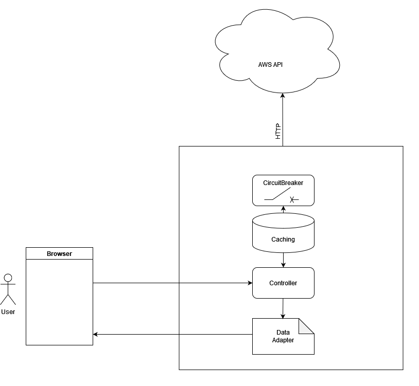
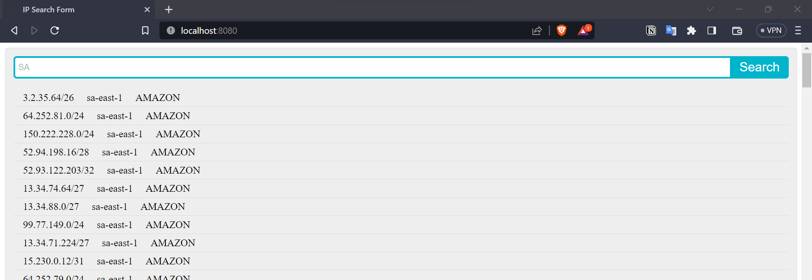
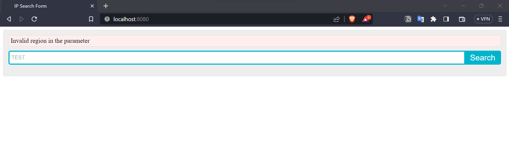

# IP Prefix Search
A simple service to search IP using AWS region.

## Prerequisites
* Gradle 8 +
* JDK 17 +

## Architecture


## Features
* Search IP Prefixes based on the AWS Region
* [**Caching** using caffeine](https://github.com/ben-manes/caffeine) for decrease the latency for use. [Link to CachedRestTemplate](./src/main/com/otto/iprangesearch/util/CachedRestTemplate.java)
* [**Circuitbreaker** using resilience4j](https://github.com/resilience4j/resilience4j) to detect failures and encapsulates the logic of preventing a failure.
* [**RaterLimiter** using resilience4j](https://github.com/resilience4j/resilience4j) to prevent huge traffic coming to the controller.
* [**Spring Actuator**](https://spring.io/guides/gs/actuator-service/) for health and metrics.
* **UI** for easy searching. 
* Multiple data adapter for json, csv output
* Unit test coverage
* Persistence of master data in H2 in-memory

> Note: 
> 1. JS is being loaded from cdn and may not work if behind proxy filter.
> 2. Region prefix is persisted in in-memory db so that validation can happen dynamically.

## Usage
* Run `docker run --rm -p 8080:8080 ghcr.io/techierishi/aws-ip-search:latest`
* Open browser and access the application by entering `http://localhost:8080/api/v1/ip-range?region=<region-prefix>`
* To change the output format to json `&dt=json`
* Optionally, you can access `http://localhost:8080/` to access th *UI* (Screenshot below)
* Access `http://localhost:8080/actuator/health` to for health checks.




## Develop

1. Clone the repository.
```
git clone https://github.com/techierishi/aws-ip-search.git
cd aws-ip-search/
```

2. Build the project.
```
./gradlew bootJar
```

3. Run the Spring Boot application.
```
./gradlew bootRun
```

### Build and run using Docker
1. Build the docker image.
```
docker build --build-arg JAR_FILE=aws-ip-search-0.0.1-SNAPSHOT.jar -t ghcr.io/techierishi/aws-ip-search:latest .
```

2. Run the application in docker container.
```
docker run --rm -p 8080:8080 ghcr.io/techierishi/aws-ip-search:latest
```

### CI/CD

* Project has two workflows in Github Actions
  1. Gradle build and unit test case. This run on each push to master
  2. Docker image creation and publish. This runs on successful Gradle build

## Improvement Areas
* Authentication/Authorization
* Separation of caching
* Faster search algorithm
* Use `Transfer-Encoding: chunked` for response. Reactive abstraction on java side
* Add Open API specification
* Possible code cleanups


*Thank you :)*
